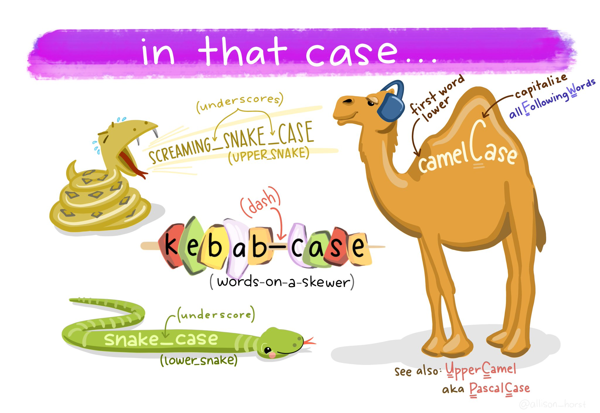

```{r setup, echo=FALSE, message=FALSE, warning=FALSE}
rm(list=objects()) # start with a clean workspace
source("knitr_setup.R")
```

> ### Learning Objectives
>
> * Get familiar with using R in RStudio
> * Create and store values as objects.
> * Know some of the ways R handles certain things, like spaces.
> * Know how to create comments with the `#` symbol.
> * Know some best practices for staying organized in R with R projects.
> * Be able to use R as a calculator.
> * Be able to compare values in R.
> * Know the distinctions between how R handles different types of data types (numbers, strings, and logicals).
> * Know how to install, load, and use functions from external R packages.

# R and RStudio

R is a programming language that runs computations, and RStudio is an interface for working with R with a lot of convenient tools and features. It is the primary [integrated development environment (IDE)](https://en.wikipedia.org/wiki/Integrated_development_environment) for R users.

You can think of the two like this:

* R is like a car's _engine_.
* RStudio is like a car's _dashboard_.

R: Engine            |  RStudio: Dashboard
:-------------------------:|:-------------------------:
{ width=200 }  |  { width=250 }

Your car needs an engine (R) to run, but having a speedometer and rear view mirrors (RStudio) makes driving a lot easier.

To get started using R , you need to download and install both R and RStudio (Desktop version) on your computer. Go to the [course prep](L0-course-prep.html) page for instructions.

Once you have everything installed, open RStudio. You should see the following:


Notice the default panes:

  * Console (entire left)
  * Environment/History (tabbed in upper right)
  * Files/Plots/Packages/Help (tabbed in lower right)

FYI: you can change the default location of the panes, among many other things: [Customizing RStudio](https://support.rstudio.com/hc/en-us/articles/200549016-Customizing-RStudio).

Go into the Console on the left with the `>` (that's the *command prompt*).

Let's get started using R!

# Your first conveRsation

When you type something into the console, R will give you a reply. Think of it like having a conversation with R. For example, let's ask R to add two numbers:

```{r}
3 + 4
```

As you probably expected, R returned `7`. No surprises here!

> Quick note: you can ignore the `[1]` you see in the returned value...that's just R saying there's only one value to return.

But what happens if you ask R to add a number surrounded by quotations marks?

```{r, error=TRUE}
3 + "4"
```

Looks like R didn't like that. That's because you asked R to add a number to something that is not a number (`"4"` is a _character_, which is different from the number `4`), so R returned an error message. This is R's what of telling you that you asked it to do something that it can't do.

Here's a helpful tip:

> EMBRACE THE ERROR MESSAGES!

By the end of this course, you will have seen loads of error messages. This doesn't mean you "can't code" or that you're "bad at coding" - it just means you've still got more work to do to solve the problem.

In fact, the best coders sometimes _intentionally_ write code with known errors in it in order to get an error message. This is because when R gives you an error message, most of the time there is a hint in it that can help you solve the problem that led to the error. For example, take a look at the error message from the last example:

```
Error in 3 + "4" : non-numeric argument to binary operator
```

Here R is saying that there was a "non-numeric argument" somewhere. That suggests that the problem might be with something not being a number. As we just discussed, `"4"` is a character, or a "non-numeric argument".

With practice, you'll get better at embracing and interpreting R's error messages.

# Storing values

You can store values by "assigning" them to an _object_ with the `<-` symbol, like this:

```{r}
x <- 2
```

Here the symbol `<-` is meant to look like an arrow. It means "assign the value `2` to the object named `x`".

> PRO TIP: To quickly type `<-`, use the shortcut `option` + `-` (mac) or `alt` + `-` (windows). There are lots of other helpful [shortcuts](https://support.rstudio.com/hc/en-us/articles/200711853-Keyboard-Shortcuts). Type `Alt` + `Shift` + `K` to bring up a shortcut reference card).

Since we assigned the value `2` to `x`, if we type `x` into the console and press "enter" R will return the stored value:

```{r}
x
```

If you overwrite an object with a different value, R will "forget" the previous assigned value and only keep the new assignment:

```{r}
x <- 42
x
```

> PRO TIP: Always surround `<-` with spaces to avoid confusion! For example, if you typed `x<-2` (no spaces), it's not clear if you meant `x <- 2` or `x < -2`. The first one assigns `2` to `x`, but the second one compares whether `x` is less than `-2`.

## Use meaningful variable names

You can choose almost any name you like for an object, so long as the name does not begin with a *number* or a special character like `+`, `-`, `*`, `/`, `^`, `!`, `@`, or `&`. But you should always use variable names that **describe the thing you're assigning**. This practice will save you major headaches later when you have lots of objects in your environment.

For example, let's say you have measured the length of a caterpillar and want to store it as an object. Here are three options for creating the object:

**Poor** variable name:
```{r}
x <- 42
```

**Good** variable name:
```{r}
length_mm <- 42
```

**Even better** variable name:
```{r}
caterpillar_length_mm <- 42
```

The first name, `x`, tells us nothing about what the value `42` means (are we counting something? `42` of what?). The second name, `length_mm`, tells us that `42` is the length of something, and that it's measured in millimeters. Finally, the last name, `caterpillar_length_mm`, tells us that `42` is the length of a caterpillar, measured in millimeters.

## Use standard casing styles

 Art by [Allison Horst](https://github.com/allisonhorst/stats-illustrations)

You will be wise to adopt a [convention for demarcating words](https://en.wikipedia.org/wiki/Camel_case) in names. I recommend using one of these:

- `snake_case_uses_underscores`
- `camelCaseUsesCaps`

Make another assignment:

```{r}
this_is_a_long_name <- 2.5
```

To inspect this, try out RStudio's completion facility: type the first few characters, press TAB - voila! RStudio auto-completes the long name for you :)

## R is case sensitive

To understand what this means, try this:

```{r}
cases_matter <- 2
Cases_matter <- 3
```

Let's try to inspect:

```{r}
cases_matter
Cases_matter
```

Although the two objects look_ similar, one has a capital "C", and R stores that as a different object.

In general, type carefully. Typos matter. Case matters. **Get better at typing**.

## The workspace

Look at your workspace in the upper-right pane. The workspace is where user-defined objects accumulate. You can also get a listing of these objects with commands:

```{r}
objects()
ls()
```

If you want to remove the object named `x`, you can do this

```{r}
rm(x)
```

To remove everything, use this:

```{r}
rm(list = ls())
```

or click the broom symbol.


# R as a calculator

You can do a ton of things with R, but at its core it's basically a fancy calculator. Let's get started with some basic arithmetic!

## Doing basic math

R handles simple arithmetic using the following **arithmetic** operators:

<div style="width:500px">

```{r arithmetic, echo=FALSE}
knitr::kable(rbind(
              c("addition", "`+`", "`10 + 2`", "`12`"),
              c("subtraction", "`-`", "`9 - 3`", "`6`"),
              c("multiplication", "`*`", "`5 * 5`", "`25`"),
              c("division", "`/`", "`9 / 3`", "`3`"),
              c("power", "`^`", "`5 ^ 2`", "`25`")
), col.names = c("operation", "operator", "example input" , "example output"), align="lccc")
```

</div>

The first four basic operators (`+`, `-`, `*`, `/`) are pretty straightforward and behave as expected:

```{r}
7 + 5 # Addition
7 - 5 # Subtraction
7 * 5 # Multiplication
7 / 5 # Division
```

Not a lot of surprises (you can ignore the `[1]` you see in the returned values...that's just R saying there's only one value to return).

Powers (i.e. $x^n$) are represented using the `^` symbol. For example, to calculate $5^4$ in R, we would type:

```{r}
5^4
```

# Comparing things in R

Other than simple arithmetic, another common programming task is to compare different values to see if one is greater than, less than, or equal to the other. R handles comparisons with **relational** and **logical** operators.

# Comparing two things

To compare two things, use the following **relational** operators:

- Less than: `<`
- Less than or equal to : `<=`
- Greater than or equal to: `>=`
- Greater than: `>`
- Equal: `==`
- Not equal: `!=`

The *less than* operator `<` can be used to test whether one number is smaller than another number:

```{r}
2 < 5
```

If the two values are equal, the `<` operator will return `FALSE`, while the `<=` operator will return `TRUE`: :

```{r}
2 < 2
2 <= 2
```

The "greater than" (`>`) and "greater than or equal to" (`>=`) operators work the same way but in reverse:

```{r}
2 > 5
2 > 2
2 >= 2
```

To assess whether two values are equal, we have to use a double equal sign (`==`):

```{r}
(2 + 2) == 4
(2 + 2) == 5
```

To assess whether two values are _not_ equal, we have to use an exclamation point sign with an equal sign (`!=`):

```{r}
(2 + 2) != 4
(2 + 2) != 5
```

It's worth noting that you can also apply equality operations to "strings," which is the general word to describe character values (i.e. not numbers). For example, R understands that a `"penguin"` is a `"penguin"` so you get this:

```{r}
"penguin" == "penguin"
```

However, R is very particular about what counts as equality. For two pieces of text to be equal, they must be _precisely_ the same:

```{r}
"penguin" == "PENGUIN"        # FALSE because the case is different
"penguin" == "p e n g u i n"  # FALSE because the spacing is different
"penguin" == "penguin "       # FALSE because there's an extra space on the second string
```

## Making multiple comparisons

To make a more complex comparison of more than just two things, use the following **logical** operators:

- And: `&`
- Or: `|`
- Not: `!`

**And**:

A logical expression `x & y` is `TRUE` only if *both* `x` and `y` are `TRUE`.

```{r}
(2 == 2) & (2 == 3) # FALSE because the second comparison if not TRUE
```
```{r}
(2 == 2) & (3 == 3) # TRUE because both comparisons are TRUE
```

**Or**:

A logical expression `x | y` is `TRUE` if *either* `x` or `y` are `TRUE`.

```{r}
(2 == 2) | (2 == 3) # TRUE because the first comparison is TRUE
```

**Not**:

The `!` operator behaves like the word *"not"* in everyday language. If a statement is "not true", then it must be "false". Perhaps the simplest example is

```{r}
!TRUE
```

It is good practice to include parentheses to clarify the statement or comparison being made. Consider the following example:

```{r}
!3 == 5
```

This returns `TRUE`, but it's a bit confusing. Reading from left to right, you start by saying "not 3"...what does that mean?

What is really going on here is R first evaluates whether 3 is equal to 5 (`3 == 5`), and then returns the "not" (`!`) of that. A better version of the same thing would be:

```{r}
!(3 == 5)
```

## Order of operations

R follows the typical BEDMAS order of operations. That is, R evaluates statements in this order^[For a more precise statement, see the [operator precedence](http://stat.ethz.ch/R-manual/R-devel/library/base/html/Syntax.html) for R.]:

1. **B**rackets
2. **E**xponents
3. **D**ivision
4. **M**ultiplication
5. **A**ddition
6. **S**ubtraction

For example, if I type:

```{r}
1 + 2 * 4
```

R first computes `2 * 4` and then adds `1`. If what you actually wanted was for R to first add `2` to `1`, then you should have added parentheses around `1` and `2`:

```{r}
(1 + 2) * 4
```

A helpful rule of thumb to remember is that **brackets always come first**. So, if you're ever unsure about what order R will do things in, an easy solution is to enclose the thing you want it to do first in brackets.

# Data types

Every programming language has the ability to store data of different types. R recognizes several important basic data types (there are others, but these cover most cases):

Type      | Description                 | Example
----------|-----------------------------|----------
`double`   | Number with a decimal place (aka "float") | `3.14`, `1.61803398875`
`integer`   | Number without a decimal place    | `1`, `42`
`character` | Text in quotes (aka "string") | `"this is some text"`, `"3.14"`
`logical`   | True or False (for comparing things) | `TRUE`, `FALSE`

If you want to check with type a value is, you can use the function `typeof()`. For example:

```{r}
typeof("hello")
```

## Numeric types

Numbers in R have the `numeric` data type, which is also the default computational type. There are two types of numbers:

- **Integers**
- **Non-integers** (aka "double" or "float")

The difference is that integers don't have decimal values. A non-integer in R has the type "`double`":
```{r}
typeof(3.14)
```

By default, R assumes all numbers have a decimal place, even if it _looks_ like an integer:
```{r}
typeof(3)
```

In this case, R assumes that `3` is really `3.0`. To make sure R knows you really do mean to create an integer, you have to add an `L` to the end of the number^[Why `L`? Well, it's a bit [complicated](https://stackoverflow.com/questions/24350733/why-would-r-use-the-l-suffix-to-denote-an-integer), but R supports complex numbers which are denoted by `i`, so `i` was already taken. A quick answer is that R uses 32-bit _long_ integers, so `L` for "long".]:
```{r}
typeof(3L)
```

## Character types

A character value is used to represent string values in R. Anything put between single quotes (`''`) or double quotes (`""`) will be stored as a character. For example:

```{r}
typeof('3')
```

Notice that even though the value _looks_ like a number, because it is inside quotes R interprets it as a character. If you mistakenly thought it was a a number, R will gladly return an error when you try to do a numerical operation with it:

```{r error=TRUE}
'3' + 7
```

It doesn't mattef if you use single or double quotes to create a character. The only time is _does_ matter is if the character is a quote symbole itself. For example, if you wanted to type the word `"don't"`, you should use double quotes so that R knows the single quote is part of the character:

```{r}
typeof("don't")
```

If you used single quotes, you'll get an error because R reads `'don'` as a character:

```{r, error=TRUE}
typeof('don't')
```

We will go into much more detail about working with character values later on in [Week 7](L7-strings.html).

## Logical types

Logical data only have two values: `TRUE` or `FALSE`. Note that these are not in quotes and are in all caps.
```{r}
typeof(TRUE)
typeof(FALSE)
```

R uses these two special values to help answer questions about logical statements. For example, let's compare whether `1` is greater than `2`:
```{r}
1 > 2
```

R returns the values `FALSE` because 1 is not greater than 2. If I flip the question to whether `1` is _less_ than `2`, I'll get `TRUE`:
```{r}
1 < 2
```

## Special values

In addition to the four main data types mentioned, there are a few additional "special" types: `Inf`, `NaN`, `NA` and `NULL`.

**Infinity**: `Inf` corresponds to a value that is infinitely large (or infinitely small with `-Inf`). The easiest way to get `Inf` is to divide a positive number by 0:

```{r}
1/0
```

**Not a Number**: `NaN` is short for "not a number", and it's basically a reserved keyword that means "there isn't a mathematically defined number for this." For example:

```{r}
0/0
```

**Not available**: `NA` indicates that the value that is "supposed" to be stored here is missing. We'll see these much more when we start getting into data structures like vectors and data frames.

**No value**: `NULL` asserts that the variable genuinely has no value whatsoever, or does not even exist.


# What else can R do?

R can do a LOT more than what we've seen thus far. For example, you can ask R to print text to the console using the `cat()` function:

```{r}
cat("Hello world!")
```

In the next section, we'll learn more about some of the distinctions between different types of values in R (like numbers and characters).

While R is a programming language, it is perhaps most commonly known as a tool for analyzing data and creating plots. For example, here's how you can use R to make a simple plot of the equation $y  = x^2$:

```{r simple-plot, warning = FALSE, message = FALSE, out.width='75%'}
x <- seq(from = -10, to = 10)
y <- x^2
plot(x, y)
lines(x, y)
```

But you can plot way more than equations in R! For example, take a look at this plot of some [actual data about penguins](https://allisonhorst.github.io/palmerpenguins/) (don't worry about the code for now - by the end of this course you'll know what it all does!):

```{r mass-flipper, warning = FALSE, message = FALSE, fig.height=5, fig.width=7}
library(ggplot2)
library(palmerpenguins)

ggplot(data = penguins, aes(x = flipper_length_mm, y = body_mass_g)) +
  geom_point(aes(color = species, shape = species),
             size = 3, alpha = 0.8) +
  scale_color_manual(values = c("darkorange","purple","cyan4")) +
  theme_minimal() +
  labs(title = "Penguin size, Palmer Station LTER",
       subtitle = "Flipper length and body mass for Adelie, Chinstrap, and Gentoo Penguins",
       x = "Flipper length (mm)",
       y = "Body mass (g)",
       color = "Penguin species",
       shape = "Penguin species") +
  theme(legend.position = c(0.2, 0.7),
        legend.background = element_rect(fill = "white", color = NA),
        plot.title.position = "plot",
        plot.caption = element_text(hjust = 0, face= "italic"),
        plot.caption.position = "plot")
```

# A couple more important points

## R ignores excess spacing

When I typed `3 + 4` before, I could equally have done this

```{r}
3        + 4
```

or this

```{r}
            3   + 4
```

Both produce the same result. The point here is that R ignores extra spaces. This may seem irrelevant for now, but in some programming languages (e.g. Python) blank spaces matter a lot!

This doesn't mean extra spaces _never_ matter. For example, if you wanted to input the value `3.14` but you put a space after the `3`, you'll get an error:

```{r, error=TRUE}
3   .14
```

Basically, you can put spaces between _different_ values, and you can put as many as you want and R won't care. But if you break a value up with a space, R will send an error message.

## Using comments

In R, the `#` symbol is a special symbol that denotes a comment. R will ignore anything on the same line that follows the `#` symbol. This enables us to write comments around our code to explain what we're doing:

```{r}
speed <- 55 # This is km/h, not mph!
speed
```

Notice that R ignores the whole sentence after the `#` symbol.

# Staying organized

## The history pane

R keeps track of your "command history." If you click on the console and hit the "up" key, the R console will show you the most recent command that you've typed. Hit it again, and it will show you the command before that, and so on.

The second way to get access to your command history is to look at the history panel in Rstudio. On the upper right hand side of the Rstudio window you'll see a tab labeled "History." Click on that and you'll see a list of all your recent commands displayed in that panel. It should look something like this:

<center>

</center>

If you double click on one of the commands, it will be copied to the R console.

## Working directory

Any process running on your computer has a notion of its "working directory". In R, this is where R will look for files you ask it to load. It's also where any files you write to disk will go.

You can explicitly check your working directory with:

```{r eval = FALSE}
getwd()
```

It is also displayed at the top of the RStudio console.

As a beginning R user, it's OK let your home directory or any other weird directory on your computer be R's working directory. _Very soon_, I urge you to evolve to the next level, where you organize your analytical projects into directories and, when working on project A, set R's working directory to the associated directory.

__Although I do not recommend it__, in case you're curious, you can set R's working directory at the command line like so:

```{r eval = FALSE}
setwd("~/myCoolProject")
```

__Although I do not recommend it__, you can also use RStudio's Files pane to navigate to a directory and then set it as working directory from the menu:

> Session > Set Working Directory > To Files Pane Location.

You'll see even more options there). Or within the Files pane, choose __More__ and __Set As Working Directory__.

But there's a better way. A way that also puts you on the path to managing your R work like an expert.

## RStudio projects

Keeping all the files associated with a project organized together -- input data, R scripts, analytical results, figures -- is such a wise and common practice that RStudio has built-in support for this via its _projects_.

[Using Projects](https://support.rstudio.com/hc/en-us/articles/200526207-Using-Projects)

Let's make one for practice. Do this:

> File > New Project ....

You should see the following pane:

<center>

</center>

Choose "New Directory". The directory name you choose here will be the project name. Call it whatever you want. RStudio will create a folder with that name to put all your project files.

As a demo, I created a project on my Desktop called "demo". RStudio created a new project called "demo", and in this folder there is a file called "demo.Rproj". If I double-click on this file, RStudio will open up, and my working directory will be automatically set to this folder! You can double check this by typing:

```{r eval = FALSE}
getwd()
```

## Save your code in .R Files

It is traditional to save R scripts with a `.R` or `.r` suffix. Any code you wish to re-run again later should be saved in this way and stored within your project folder. For example, if you wanted to re-run all of the code in this tutorial, open a new `.R` file and save it to your R project folder. Do this:

> File > New File > R Script

You can copy some of the code we've typed so far into this file to re-run it again later:

```{r eval = FALSE}
3 + 4
3 + "4"
x <- 2
x
x <- 42
x
this_is_a_long_name <- 2.5
cases_matter <- 2
Cases_matter <- 3
cases_matter
Cases_matter
objects()
ls()
rm(x)
rm(list = ls())
cat("Hello world!")
x <- seq(from = -10, to = 10)
y <- x^2
plot(x, y)
lines(x, y)
3        + 4
            3   + 4
2 + 2 # I'm adding two numbers
getwd()
```

Then save this new R script with some name. Do this:

> File > Save

I called the file "tutorial.R" and saved it in my R project folder called "demo".

Now when I open the "demo.Rproj" file, I see in my files pane the "tutorial.R" code script. I can click on that file and continue editing it!

I can also run any line in the script by typing "Command + Enter" (Mac) or "Control + Enter" (Windows).


# Functions

You can do a lot with the basic operators like `+`, `-`, and `*`, but to do more advanced calculations you're going to need to start using functions.^[Technically speaking, operators are functions in R: the addition operator `+` is a convenient way of calling the addition function `'+'()`. Thus `10+20` is equivalent to the function call `'+'(20, 30)`. Not surprisingly, no-one ever uses this version.]

> [Watch this 1-minute video for a quick summary of **functions**](https://vimeo.com/220490105)

R has a lot of very useful built-in functions. For example, if I wanted to take the square root of 225, I could use R's built-in square root function `sqrt()`:

```{r}
sqrt(225)
```

Here the letters `sqrt` are short for "square root," and the value inside the `()` is the "argument" to the function. In the example above, the value `225` is the "argument".

Keep in mind that not all functions have (or require) arguments:

```{r}
date() # Returns the current date and time
```

(the date above is the date this page was last built)

## Multiple arguments

Some functions have more than one argument. For example, the `round()` function can be used to round some value to the nearest integer or to a specified decimal place:

```{r}
round(3.14165)    # Rounds to the nearest integer
round(3.14165, 2) # Rounds to the 2nd decimal place
```

Not all arguments are mandatory. With the `round()` function, the decimal place is an _optional_ input - if nothing is provided, the function will round to the nearest integer by default.

## Argument names

In the case of `round()`, it's not too hard to remember which argument comes first and which one comes second. But it starts to get very difficult once you start using complicated functions that have lots of arguments. Fortunately, most R functions use **argument names** to make your life a little easier. For the `round()` function, for example, the number that needs to be rounded is specified using the `x` argument, and the number of decimal points that you want it rounded to is specified using the `digits` argument, like this:

```{r}
round(x = 3.1415, digits = 2)
```

## Default values

Notice that the first time I called the `round()` function I didn't actually specify the `digits` argument at all, and yet R somehow knew that this meant it should round to the nearest whole number. How did that happen? The answer is that the `digits` argument has a **default value** of `0`, meaning that if you decide not to specify a value for `digits` then R will act as if you had typed `digits = 0`.

This is quite handy: most of the time when you want to round a number you want to round it to the nearest *whole* number, and it would be pretty annoying to have to specify the `digits` argument every single time. On the other hand, sometimes you actually do want to round to something other than the nearest whole number, and it would be even more annoying if R didn't allow this! Thus, by having `digits = 0` as the default value, we get the best of both worlds.

## Function help

Not sure what a function does, how many arguments it has, or what the argument names are? Ask R for help by typing `?` and then the function name, and R will return some documentation about it. For example, type `?round()` into the console and R will return information about how to use the `round()` function.

## Combining functions

In the same way that R allows us to put multiple operations together into a longer command (like `1 + 2 * 4` for instance), it also lets us put functions together and even combine functions with operators if we so desire. For example, the following is a perfectly legitimate command:

```{r}
round(sqrt(7), digits = 2)
```

When R executes this command, starts out by calculating the value of `sqrt(7)`, which produces an intermediate value of `2.645751`. The command then simplifies to `round(2.645751, digits = 2)`, which rounds the value to `2.65`.

# Frequently used functions

## Math functions

R has LOTS of functions. Many of the basic math functions are somewhat self-explanatory, but it can be hard to remember the specific function name. Below is a reference table of some frequently used math functions.

Function   | Description       | Example input    | Example output
---------- | ------------------|------------------|---------------
`round(x, digits=0)` | Round `x` to the `digits` decimal place | `round(3.1415, digits=2)` | ``r round(3.1415, digits=2)``
`floor(x)` | Round `x` **down** the nearest integer | `floor(3.1415)` | ``r floor(3.1415)``
`ceiling(x)` | Round `x` **up** the nearest integer | `ceiling(3.1415)` | ``r ceiling(3.1415)``
`abs()`    | Absolute value    | `abs(-42)`   | ``r abs(-42)``
`min()`    | Minimum value     | `min(1, 2, 3)`   | ``r min(1, 2, 3)``
`max()`    | Maximum value     | `max(1, 2, 3)`   | ``r max(1, 2, 3)``
`sqrt()`   | Square root       | `sqrt(64)`       | ``r sqrt(64)``
`exp()`    | Exponential       | `exp(0)`         | ``r exp(0)``
`log()`    | Natural log       | `log(1)`         | ``r log(1)``
`factorial()` | Factorial      | `factorial(5)`   | ``r factorial(5)``

## Functions for manipulating data types

You will often need to check the data type of objects and convert them to other types. To handle this, use these patterns:

- Check the type of `x`: `is.______()`
- Convert the type of `x`: `as.______()`

In each of these patterns, replace "`______`" with:

- `character`
- `logical`
- `numeric` / `double` / `integer`

### Converting data types

You can convert an object from one type to another using `as.______()`, replacing "`______`" with a data type:

Convert **numeric** types:
```{r}
as.numeric("3.1415")
as.double("3.1415")
as.integer("3.1415")
```

Convert **non-numeric** types:
```{r}
as.character(3.1415)
as.logical(3.1415)
```

A few notes to keep in mind:

1) When converting from a **numeric** to a **logical**, `as.logical()` will always return `TRUE` for any numeric value other than `0`, for which it returns `FALSE`.

    ```{r}
    as.logical(7)
    as.logical(0)
    ```

    The reverse is also true
    ```{r}
    as.numeric(TRUE)
    as.numeric(FALSE)
    ```

2) Not everything can be converted. For example, if you try to coerce a character that contains letters into a number, R will return `NA`, because it doesn't know what number to choose:

    ```{r}
    as.numeric('foo')
    ```

3) The `as.integer()` function behaves the same as `floor()`:

    ```{r}
    as.integer(3.14)
    as.integer(3.99)
    ```

### Checking data types

Similar to the `as.______()` format, you can check if an object is a specific data type using `is.______()`, replacing "`______`" with a data type.

Checking **numeric** types:
```{r}
is.numeric(3.1415)
is.double(3.1415)
is.integer(3.1415)
```

Checking **non-numeric** types:
```{r}
is.character(3.1415)
is.logical(3.1415)
```

One thing you'll notice is that `is.integer()` often gives you a surprising result. For example, why did `is.integer(7)` return `FALSE`?. Well, this is because numbers are _doubles_ by default in R, so even though `7` _looks_ like an integer, R thinks it's a double.

The safer way to check if a number is an integer in _value_ is to compare it against itself converted into an integer:
```{r}
7 == as.integer(7)
```

# More functions with **packages**

When you start R, it only loads the "Base R" functions (e.g. `sqrt()`, `round()`, etc.), but there are thousands and thousands of additional functions stored in external **packages**.

> [Watch this 1-minute video for a quick summary of **packages**](https://vimeo.com/220490447)

## Installing packages

To install a package, use the `install.packages()` function. Make sure you put the package name in quotes:

```{r eval=FALSE}
install.packages("packagename") # This works
install.packages(packagename)   # This doesn't work
```

Just like most software, you only need to _install_ a package once.

## Using packages

After installing a package, you can't immediately use the functions that the package contains. This is because when you start up R only the "base" functions are loaded. If you want R to also load the functions inside a package, you have to _load_ that package, which you do with the `library()` function. In contrast to the `install.packages()` function, you don't need quotes around the package name to load it:

```{r eval=FALSE}
library("packagename") # This works
library(packagename)   # This also works
```

Here's a helpful image to keep the two ideas of _installing_ vs _loading_ separate:

{ width=800 }

## Example: **wikifacts**

As an example, try installing the [Wikifacts](https://github.com/keithmcnulty/wikifacts) package, by Keith McNulty:

```{r eval=FALSE}
install.packages("wikifacts") # Remember - you only have to do this once!
```

Now that you have the package installed on your computer, try loading it using `library(wikifacts)`, then trying using some of it's functions:

```{r}
library(wikifacts) # Load the library
```
```{r}
wiki_randomfact()
wiki_didyouknow()
```

In case you're wondering, the only thing this package does is generate messages containing random facts from [Wikipedia](https://www.wikipedia.org/).

## Using only _some_ package functions

Sometimes you may only want to use a single function from a library without having to load the whole thing. To do so, use this recipe:

> packagename::functionname()

Here I use the name of the _package_ followed by `::` to tell R that I'm looking for a function that is in that package. For example, if I didn't want to load the whole **wikifacts** library but still wanted to use the `wiki_randomfact()` function, I could do this:

```{r}
wikifacts::wiki_randomfact()
```

Where this is particularly handy is when two packages have a function with the same name. If you load both library, R might not know which function to use. In those cases, it's best to also provide the **package** name. For example, let's say there was a package called **apples** and another called **bananas**, and each had a function named `fruitName()`. If I wanted to use each of them in my code, I would need to specify the package names like this:

```{r, eval=FALSE}
apples::fruitName()
bananas::fruitName()
```


---

**Page sources**:

Some content on this page has been modified from other courses, including:

- "Case" art by [Allison Horst](https://github.com/allisonhorst/stats-illustrations)
- Danielle Navarro's book ["Learning Statistics With R"](https://learningstatisticswithr.com/book/introR.html)
- Danielle Navarro's website ["R for Psychological Science"](https://psyr.djnavarro.net/)
- Jenny Bryan's [STAT 545 Course](http://stat545.com/)
- [Modern Dive](https://moderndive.netlify.com/), by Chester Ismay & Albert Y. Kim
- [RStudio primers](https://rstudio.cloud/learn/primers/1.2)
- Xiao Ping Song's [Intro2R crash course](https://github.com/xp-song/Intro2R)
